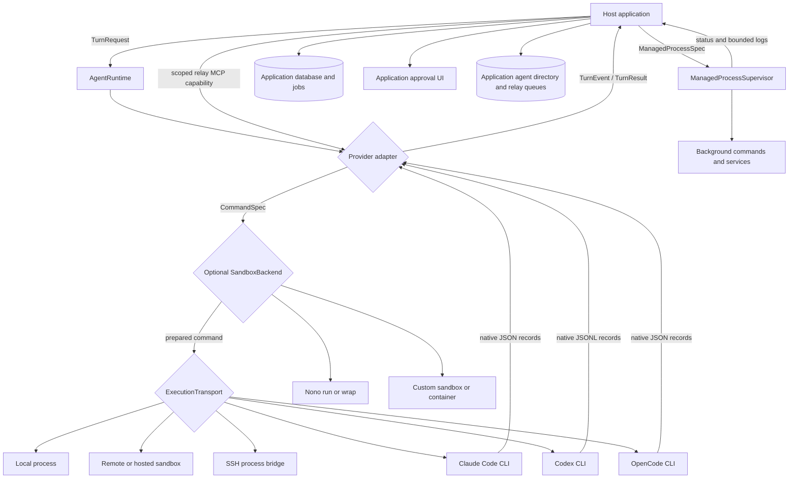

# Architecture and security model

## Boundary

The runtime is a library, not an agent service. It owns one responsibility:
turn a provider-neutral request into a supervised local or remote process and
a provider-neutral stream.

The application remains the source of truth for jobs, durable events,
approvals, sessions, telemetry, retention, and user authorization. Moving those
responsibilities into a reusable crate would couple every consumer to one
storage or transport model.

## Why process adapters

Claude's Agent SDK, Codex's CLI/app-server, and OpenCode expose different
transport choices. The initial common denominator is the installed headless
executable. That allows Rust applications to share supervision and event
semantics without embedding JavaScript runtimes or provider credentials.

The `AgentAdapter` trait isolates provider protocol differences.
`ExecutionTransport` independently isolates where the provider process runs.
A provider executable, workspace path, and session filesystem belong to that
transport; they do not need to exist on the SDK host.

## Turn lifecycle

1. Validate bounded request fields.
2. Ask the selected transport to validate its working directory.
3. Acquire a global concurrency permit, cancellably.
4. Ask the adapter for a separated `CommandSpec`.
5. Add only explicit, size-bounded secret environment values to a sanitized
   harness environment. Their values are diagnostic-redacted but remain
   readable by the harness and its descendants.
6. If configured, prepare the command with a sandbox backend; any error stops the turn.
7. Ask the transport to spawn the provider in an owned process tree.
8. Write the initial stdin payload and stream bounded stdout records.
9. Translate records and await application-owned interactions when needed.
10. On cancellation, timeout, sink failure, or future drop, terminate the
   process tree.
11. On a natural provider exit, preserve or terminate remaining tool descendants
    according to `ToolProcessPolicy` (preserve by default).
12. Return a typed result or typed failure and release the permit.

Claude native subagents remain inside the same provider process and stream.
The adapter maps Task/Agent lifecycle records to `TasksChanged` and
`TaskActivity`, associates nested tools with their native task IDs, and keeps
interactive stdin open when Claude reports a parent result before background
tasks clear.

Agent Relay is a separate, opt-in boundary for independent top-level agents.
The SDK defines stable logical addresses, messages, grants, delivery state, and
an MCP method adapter. The application authenticates a scoped sender, implements
the durable router, schedules recipient turns, and persists/reconciles receipts.
Agents never connect directly. Relay messages are delivered to providers as
safely delimited user-level input with typed provenance, never as system
instructions. An ordinary assistant response stays local unless the agent makes
an explicit relay send/reply tool call.

Background commands that require provider-independent ownership use a separate
`ManagedProcessSupervisor`. Its lifecycle is application-scoped rather than
turn-scoped. Retaining the supervisor or a handle keeps the process owned after
the turn; dropping the final owner stops its process tree.

## Trust model

The provider process and repository content are untrusted. The runtime avoids
shell interpolation, bounds growing input and output, sanitizes inherited
environment variables, and redacts explicit secrets from `Debug` output.
The SSH transport stages provider invocations through an owner-only remote
launcher so configuration and secret environment values never enter the local
SSH client's argument vector.

An optional `SandboxBackend` provides a stronger outer boundary. Nono is the
first implementation. The presence of a backend is not treated as proof that
every control is active: the request declares required capabilities and the
configured backend declares what it enforces. Nono `run` and `wrap` expose
distinct reports. Sandbox setup is fail-closed. Custom backend declarations
are trusted application code rather than runtime attestation.

The host is trusted to:

- authorize the requested provider, workspace, model, and permission mode;
- configure provider and Nono credentials safely;
- avoid logging sensitive event payloads;
- persist only data allowed by its product policy;
- keep provider CLI and Nono versions tested and patched.
- authenticate Agent Relay capabilities, authorize both ends, persist
  idempotency and at-least-once queue state, and enforce application approval.

## Backpressure and bounded work

The runtime has an explicit concurrency semaphore. It reads one provider line
at a time and awaits the event sink, so a slow consumer cannot cause an
unbounded in-memory event queue. Prompt, line, and stderr limits protect the
remaining growing buffers.

The retained client also caps acquired runtimes, while the remote protocol host
separately caps completed idempotency responses and concurrently pending
requests. Applications can lower those defaults to match a tenant or execution
target budget. Abandoned protocol dispatch futures release their pending claim
instead of leaving duplicate callers blocked indefinitely.

This is process-level concurrency, not a durable scheduler. The host
application should continue to own queued/running/succeeded/failed/cancelled
job state and user-visible progress.

## Compatibility policy

Provider JSON formats are external protocols. Compatibility coverage should be
added before supporting new frames or CLI versions. Unknown frames are ignored
only when doing so is safe; malformed known-stream JSON is a typed protocol
failure.

The crate follows semantic versioning. Public enums and errors are
non-exhaustive so additive provider capabilities can ship in minor releases.
